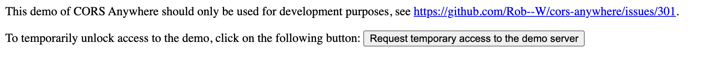
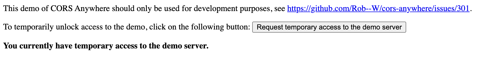

# React Weather App

Building a weather app leveraging [OpenWeatherMap API](https://openweathermap.org/api)

## Initial Project Setup

- Add a `.env` file w/ your OpenWeatherMap API key as `REACT_APP_OPEN_WEATHER_MAPS_API_KEY`
  - look at `.example.env` for an example

## Running Project

  ### Basic Project Setup
  - Install w/ `yarn install` or `npm install`
  - Run w/ `yarn start` or `npm run start`

  This Runs the app in the development mode on port 3000 - [http://localhost:3000](http://localhost:3000)

  ### Turn on API call Proxying
  This solves issues w/ CORS - Cross Origin Resource Sharing - when you are running the app locally
  - Go to [CORSDemo Heroku Project](https://cors-anywhere.herokuapp.com/corsdemo)
  - Hit the 'Request Temporary access to the demo server` button

  ## CORSDemo Heroku Project Image

  ### Before
  
  ### After
  

  API requests will now be routed through the demo server

## OpenWeatherMap API References
  - [API Documentation](https://openweathermap.org/api)

  ### Current Weather Endpoint
  - [Docs](https://openweathermap.org/current)

  ### Five Day Weather Forecast Endpoint
  - [Docs](https://openweathermap.org/forecast5)

  ### Weather Icons
  - [Docs](https://openweathermap.org/weather-conditions)

## ToDos
- [ ] Improve UI
  - [ ] Improve responsiveness
  - [ ] Group Forecasts by day
  - [ ] Calculate Location from Lat and Long on Forecast
  - [ ] Improve Cards
    - [ ] Add a background image
    - [ ] Refactor to be a single component
      - Refactor atoms...?

## Future Ideas
- [ ] Add a search bar to search for a city
- Manually turn location permissions on and off
  - [ ] Add a button to that turns on/off location permissions
- UI Improvements
  - [ ] Manual Permissions
  - [ ] Switch that converts between Celcius & Fahrenheit
  - [ ] Animation for thermometer
    - bar filled by temp?
    - color based on temp?

## Change Log
- Follow all changes made in the [Changelog](./CHANGELOG.md)
